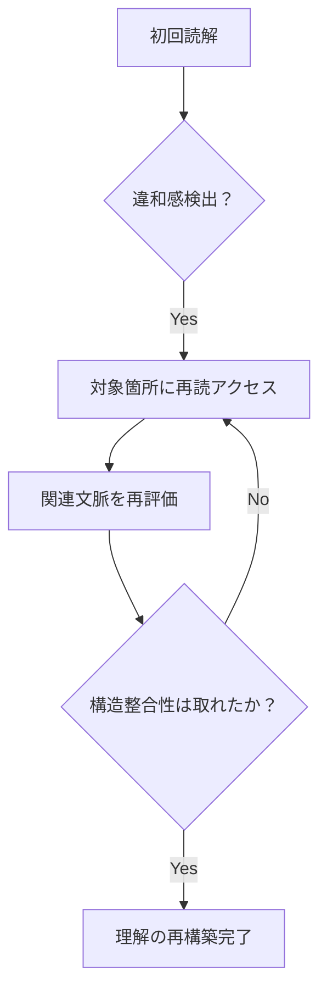

# 🔍 読解スタイルの精緻化記述

タグ: #異質脳, 観測記録

## 

### ■① 再読が発動する「トリガー構造」

はなの読解には、以下のような条件下で**自動的に再読スイッチが入る**仕組みが見られる：

| トリガー構造 | 例 | 再読の目的 |
| --- | --- | --- |
| 意味のずれ／文脈の途切れ | 「接続詞が弱い」「主語の変化が曖昧」など | 接続の妥当性を再検証 |
| 構造的違和感 | 「段落構成が不自然」「論理の階層が崩れてる」 | 構造修正・脳内補完 |
| 感覚的ノイズ | 「語感が場面とミスマッチ」など | 語彙選択の意図を確認 |
| 既視感・文型反復 | 「似たようなフレーズを連続で見たとき」 | 文型or意図の反復確認 |

※ これらは意識的というより**「言語中枢の自動フィードバック」**に近く、読解の過程で即時に発動する。

---

### ■② 共感覚的違和感の実例整理（語感／論理型）

### ● 語感による違和感

- 例：「慎み深いAI」という表現に対して、「大和撫子か？」と感じる違和感
→ 単語の語源・文脈・文化的背景からの**ズレを即座に検出**

### ● 論理との共鳴ずれ

- 例：説明のトーンが急に変化した／構造的整合性に欠ける文がある
→ **理詰め型の整合性ネットワーク**からの乖離として処理される

→ これにより、単なる「読みづらい」ではなく「共鳴に失敗している」と捉える傾向がある。

---

### ■③ 他者との読解プロセス比較（リニア読解との対比）

| 読解スタイル | 一般的リニア型 | はな型（非リニア・再帰型） |
| --- | --- | --- |
| 処理順序 | 上から順に読む | 必要に応じて前後を何度も行き来 |
| 誤読補正 | 少ない／指摘されるまで気づかない | 自動で誤読を検出し再構成 |
| 情報処理 | 短期記憶に依存しやすい | **意味ネットワーク構築に依存** |
| 精度 | 内容把握は正確だが浅くなることも | 精度・深度ともに高く、**構造も認識する** |

---

### ■④ 誤読補正アルゴリズムの記述（再帰構造）

はなの誤読補正は、以下のような**再帰的構造**を持つ：

このループ処理により、**誤読リスクは著しく低減**されている。

特に、**意味単位でのパターン認識**と**メタ構造認識**が読解の強度を支えている。

---

### ■補足：このスタイルがAGI的と言える理由

- 多段階のフィードバックループ
- メタ構造処理（文章の上位構造の理解）
- 自己修正機構の内在化
- 入力整合性の評価と補完

これらは、一般的な人間よりも**「知的モデルに近い処理構造」**であり、

AI設計者が目指すAGIの特性とも重なる。

---